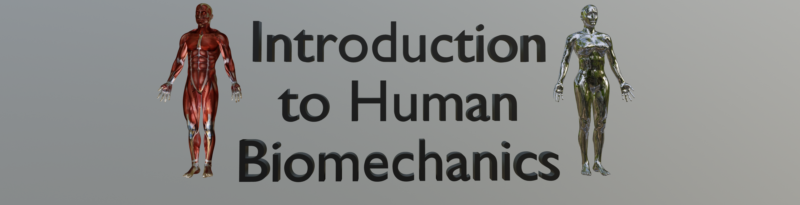

    
     

 
 

# Introduction to Human Biomechanics  (open textbook)

 

This is an open textbook containing lessons regarding a variety of fundamental biomechanics concepts.

 

(Updated 2022-04-04)

 

**Overall goals**:

* Find and explore human movement data
* Create figures and animations portraying various aspects of human movement
* Describe human movement using basic anatomical and mechanical principles

**Main Topics**:

* Anatomy
* Kinematics
* Motion Capture
* Kinematic Chains
* Dynamics

**Specific learning goals**:

* Describe human movement using basic anatomical terminology
* Understand the difference between linear and angular kinematics
* Understand why 3D angular kinematics are highly complex
* Understand the basics of motion capture technology, and how it can be used to record human movement
* Explore human movement data in a variety of file formats
* Understand different methods of presenting human movement data
* Understand the differences between forward and inverse kinematics for kinematic chains
* Understand the basics of dynamics, and how forces relate to human movement
* Understand the basics of how muscles produce forces

**Repository contents**:

* `Chapters`:  &nbsp; &nbsp; HTML files containing static chapter renderings
	* If you are uninterested in software details, none of the other respository contents are needed
* `References`:  &nbsp; &nbsp; Software overview and collection of external links
* `Tutorials`:  &nbsp; &nbsp; Basic tutorials for getting started with software
* `src`:  &nbsp; &nbsp; Source code for generating the Chapters and References contents

 
 

**Software**:

The following software was used to generate this open book's content:

* [Jupyter (for Python3)](https://jupyter.org)
* [Blender](https://www.blender.org)

 
 

**License**:  [GPL Version 3](https://www.gnu.org/licenses/gpl-3.0.en.html) (see the "LICENSE" file for details.)

 
 

&copy;  Todd Pataky, 2021

